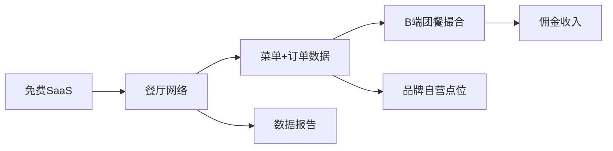

# SuriOrder 总览

> WhatsApp-first 在线点餐 SaaS → 苏里南餐饮数据入口 → B 端团餐引擎

## 核心逻辑链

## 笔记索引

| 笔记 | 一句话 |
|------|--------|
| [[产品战略]] | 三层模式：SaaS免费→团餐变现→品牌自营 |
| [[价值主张]] | 不卖工具替代，卖增量收入 |
| [[冷启动手册]] | 关系先行，一家一家聊出来 |
| [[产品功能路线图]] | P0-P3 功能优先级 |
| [[数据资产]] | 数据比软件值钱 |
| [[变现路径]] | 从免费到收入的完整时间线 |
| [[竞争分析]] | 壁垒不在代码，在关系和数据 |
| [[苏里南本土洞察]] | 族群信任、现金社会、多语言 |
| [[推销话术]] | 见老板说什么，逐句拆解 |
| [[技术架构]] | 技术选型、部署、demo 入口 |

## 当前状态

- [x] 产品 V1 上线 (suriorder.onrender.com)
- [x] 四语言 (nl/en/zh/es)
- [x] Demo 店铺可演示
- [ ] 第一家试点餐厅
- [ ] B 端团餐启动
